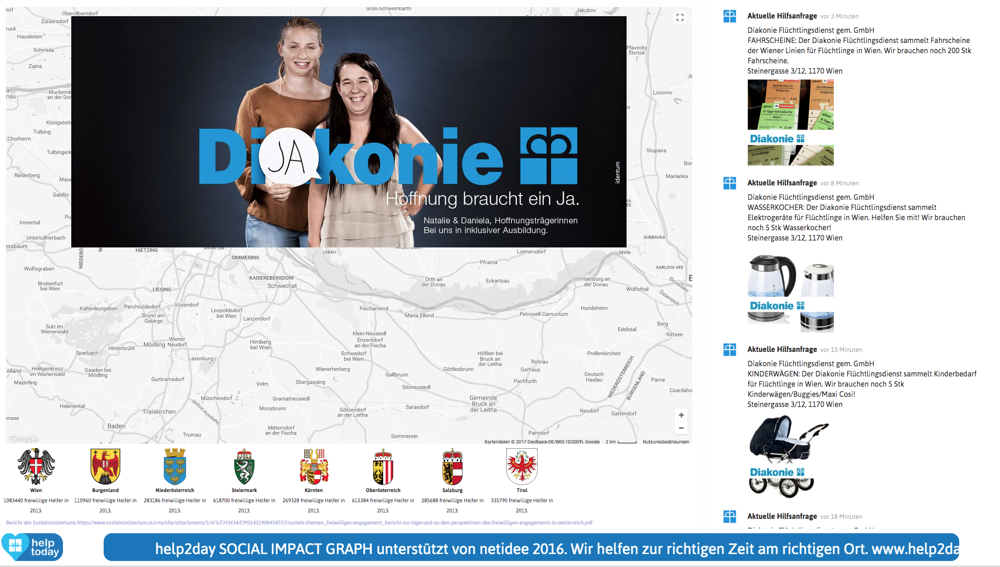

# help2day
hel2day.org is a platform for publishing help requests from non profit and non governmental organizations (NGO). 
This repo contains the core software parts of the platform including a backend, a web app and a kiosk mode module called social impact graph.

## Goals

We have observed that many NGO publish help requests on their web pages. However, there are only view services which collect this information and
present the complete picture on one platform. Also, we found that outside of NGOs it is hard for helpers to find each other in communities.
This is why we started to develop help2day.org.

The goals of help2day.org are:

1. Collect and present help requests in a way that helpers can easily find suitable cases where they can efficiently give their help

1. Allow helpers to get in touch with each other to form small communities

Our goal is to make required help visible outside of information containers and to guide altruistic persons to points where they can help efficiently.
In Austria there are about 3.5 million persons providing volunteer work in all kinds of activities. This is almost 50% of the population. However, 
registered at NGOs for permanent support are only about 500.000 persons. We think that out of the 3.5 million people there are many more who would help
if they would know how near and easy it is to help. So we want to activate more people to actually involve themselves. This goal requires two
important conditions.

1. Content: the platform has to contain a representative number of help requests for a region

1. Low barrier: the help requests on the platform must not present any barrier and strings attached. It must be easy to understand should not require any special skills. 

With this low barrier offering we hope to involve more people in volunteer work and by this to strengthen the civil society.

## Technical Overview

help2day.org consists of three software parts. The main part is the **web app** that presents current help requests on a map and as an ordered list.
The second part is a **customer relationship management tool** (CRM) that allows to administer help requests for NGOs and other settings. The third part is the **social impact graph**, a
tool that produces a public display page which can be shown on screens in order to make passers by aware of the help requests. 

### Language

Since we are located in Austria, the current version of the system is coded for **German** language. We are looking for support for internationalization 
of the software and for building of language packages for English, Greek and Kroatian language.

## User Documentation

### Volunteers

A volunteer uses the platform to find help requests around its home location or work location.
This can be done without registration. Since there may be many help requests, a volunteer can
register on the platform and enter her/his preferences to have the list of help requests ordered
according to the preferences. This helps to get an overview.

The following video gives an overview of the functions of the web app (in german).  

### NGOs

The following video gives an overview of the functions and usage of the CRM tool. 

](http://www.youtube.com/watch?v=VvIGxH3NhJs)

### Social impact graph

The social impact graph is a visual kiosk mode display for help requests. 
The graph can be started using the following url [https://app.help2day.org/sig?ks_key=netidee16](https://app.help2day.org/sig?ks_key=netidee16)
The CRM allows the configuration of different sessions with filters and geographical settings.

 
The social impact graph contains the following elements:

1. The map shows filtered help requests in the selected area. The area can be controlled in the CRM or via control elements on the graph.

1. The timeline on the right shows events of this session. Events are either created by the CRM tool or via the API (see API documentation).

1. A video and image overlay shows images and videos for short periods every 60 seconds.

1. A statistics field at the bottom displays selected statistics.

1. A news ticker at the bottom displays a fixed message or the latest help requests.

## System Documentation

The system documentation describes the general layout of the software and gives a clue how to use and modify the functionality.
The documentation can be found [here](documentation/system.md).

## Contributing

Please contact us via email for details on participating in the development.

## Authors

* **Dietmar Millinger** - *Initial version of core modules in german* 

See also the list of [contributors](https://github.com/ditomaximal/help2day/contributors) who participated in this project.

## License

This project is licensed under the MIT License - see the [LICENSE](LICENSE) file for details

## Acknowledgments

We use a lot of open source software in the project. It is impossible to list all of the contributors. But we want to **thank all of you**. 
Here is just a small list of components we use and love..

* node.js
* express.js
* moment.js
* knex.js
* crypto.js
* semantic-ui

